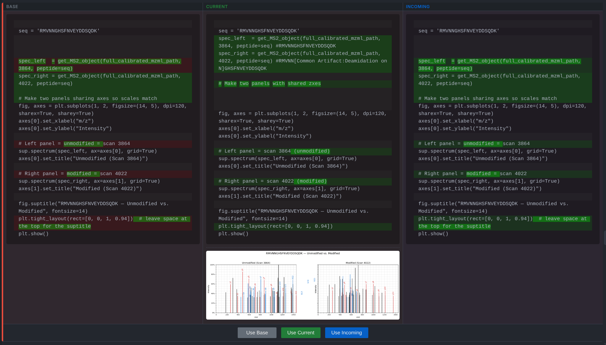
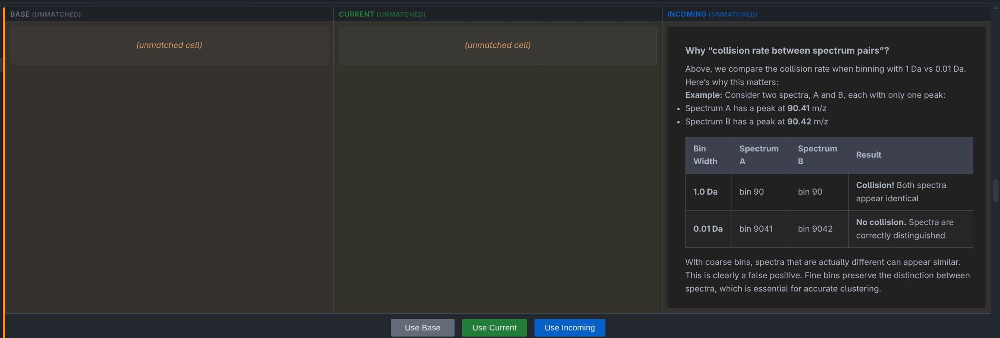
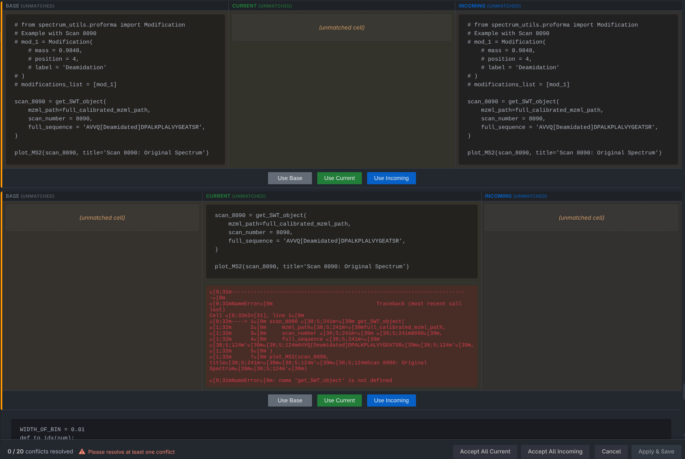

# MergeNB

A VS Code extension for resolving merge conflicts in Jupyter notebooks (`.ipynb` files).

## The Problem

Git doesn't know how to resolve git merge conflicts with Jupyter Notebooks at all. It doesn't even necessary know there ARE any conflicts, least of all where. So, alternate "mergetools" are used to create a specialized UI  

The canonical solution is nbdime, a collection of tools designed just for this purpose; however, it has been buggy and unreliable in my experience. Specifically, conflicts that can be found via mergeNB often just go undetected entirely with nbdime.
 
## Features


MergeNB aims to fix all of that. It features, in no particular order:

(a) 3 way merge interface: each cell is compared across 3 versions, current, incoming, and base (the most common ancestor of current and incoming).

(b) Conflict detection: We parse through each set of cells - and match them with each other across stable index changes - in order to compute a "diff" (conflict) between each of current/incoming/base. This logic allows us to detect conflicts that would otherwise go unnoticed.




(c) Unmatched Cells: Cells that are unmatched (eg. new cells added in one branch, as well as cells that we can't 100% match across branches) are also shown in the merge interface, allowing users to manually resolve them.



*New cell, not in either base or incoming*


*This cell should be matched, but it is >30% different from the other two. This requires manual resolution*


## Extension Settings

- mergeNB.autoResolve.executionCount: Automatically resolve execution count differences by setting `execution_count` to `null`. Default = true

- mergeNB.autoResolve.kernelVersion: Prefer the current kernel/version metadata during resolution. Default = true

- mergeNB.autoResolve.stripOutputs: Strip cell outputs during automatic resolution to avoid output-only conflicts. Default = true

- mergeNB.ui.showCellHeaders: Show per-cell headers (cell index, type, execution count) in the conflict resolver UI. Default = false

This list will remain up-to-date.

## Known Issues

See issues tab :)

## Manual Testing

Your efforts are highly appreciated!

1. You can download the merge-nb-0.0.1.vsix file from the releases page and install it in your VS Code instance with the command "Extensions: Install from VSIX..." in the command palette.

2. I'm most interested in (a) whether the merge resolution UI is usable and intuitive (make an issue!), and (b) all the "I/O" is right.

That is, there's 2 places which are most error prone. 

One is whilst creating the conflict resolver UI, wherein cells can be deleted, overly unmatched, overly conflicted, in the wrong spots, etc.

The other is upon resolving each of your conflicts. Here, cells in the original notebook SHOULD maintain the same order as in the webview, and no cells should be duplicated/deleted unless you chose to do so.

For heavily complex notebooks, I am happy to take screen recordings of the notebook before/while resolving/after resolving, if you don't want to track all of that. Feel free to make an issue + add a link to it.


## Development


```bash
git clone https://github.com/Avni2000/MergeNB.git

cd MergeNB

npm install

npm run compile

# To run the extension in a new VS Code window

code --extensionDevelopmentPath=$(pwd) --new-window /path/to/a/repo/with/merge/conflicts

# to make a .vsix package

npm install -g vsce

vsce package
```
