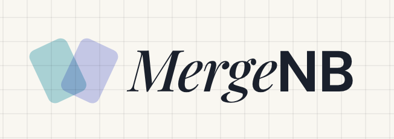

<div align="center">



**An intuitive merge conflict resolver built for Jupyter notebooks in VS Code.**

[](https://github.com/Avni2000/MergeNB/actions/workflows/all-tests.yml)
[](https://github.com/Avni2000/MergeNB)
[](https://code.visualstudio.com/)
[](https://www.gnu.org/licenses/gpl-3.0)
</div>

> [!NOTE]
> Promise to get back to this in the fall! I'm a bit busy at the moment, so I'm taking a break. Everything should still "work" but it won't be in active development for a bit. 


## Features

**Conflict Resolution UI**: Side-by-side 2-way and 3-way diff views with intra-cell conflict highlighting.

**Reordered Cell Handling**: Uses the Hungarian Algorithm on a semantic distance cost matrix to optimally match cells across reorderings.

**All MIME Types Supported**: Renders HTML, LaTeX, images, SVG plots, and more using the same engine as JupyterLab.

**Auto-Resolution**: Automatically resolves common conflict classes like mismatched execution counts, kernel versions, and whitespace diffs.

**Configurable**: Customize auto-resolution rules, UI themes, and hotkeys via [MergeNB settings](https://avni2000.github.io/MergeNB/docs/settings).

**Undo/Redo**: Full action history with a panel to jump to any prior state of the resolver.

**Syntax Highlighting**: [CodeMirror](https://codemirror.net/)-powered highlighting for Python, Scala, R, Julia, and any other Jupyter-supported language.


## Documentation

**Browse the [MergeNB documentation site](https://avni2000.github.io/MergeNB/docs).**

## Installation

See complete [installation instructions on the docs site](https://avni2000.github.io/MergeNB/docs/installation) 

**TL;DR:**

1. Check out the Release page for the last stable version - [MergeNB Releases](https://github.com/Avni2000/MergeNB/releases) - and install the `.vsix` file from there.

2. Then, go to VSCode, look up "Extensions: Install from VSIX..." in the Command Palette, and select the downloaded file.


## Quick start

### 1) Open conflicted notebooks

- Command: `MergeNB: Find Notebooks with Merge Conflicts`
- ID: `merge-nb.findConflicts`
- Also available from notebook context actions and status bar when applicable.

<!-- [Screenshot: Command Palette showing "MergeNB: Find Notebooks with Merge Conflicts"] -->

### 2) Resolve in MergeNB UI

Typical flow:

1. See git merge conflicts within a notebook
2. Launch MergeNB command
3. Review each conflict row
4. Choose `base`, `current`, `incoming`, or `delete` per conflict
5. Optionally edit or delete the resolved source text
6. Apply resolution and return to VS Code


### Screenshots and Demos:


<div>
    <div>
        
    </div>
    <div>
        
    </div>
</div>

## Configuration

The [settings page within the docs site](https://avni2000.github.io/MergeNB/docs/settings) is a great resource for this.

## How MergeNB Resolves Conflicts

When multiple branches edit the same notebook file and then get merged, Git detects conflicts at the file level. However, since `.ipynb` files are JSON documents, Git's line-based diff/merge can produce conflicts that are difficult to interpret and resolve manually.

MergeNB applies three-way logic on matched notebook entities (`source`, `metadata`, `outputs`, `execution_count`). 

Here, we define `BASE` as the common ancestor version, `CURRENT` as the current branch version, and `INCOMING` as the incoming branch version to merge into current. The resolution logic for each entity is as follows:

```text
if CURRENT == BASE == INCOMING:
        result = any of them (all identical)
elif CURRENT == INCOMING:
        result = CURRENT  (both sides made same change, or didn't change)
elif CURRENT == BASE:
        result = INCOMING  (only INCOMING changed)
elif INCOMING == BASE:
        result = CURRENT   (only CURRENT changed)
else:
        CONFLICT  (all three differ)
```

I compiled all of my notes about this into one document at [docs/architecture](https://avni2000.github.io/MergeNB/docs/architecture/merge-lifecycle)


## Development

See [Installation](https://avni2000.github.io/MergeNB/docs/installation) for building MergeNB locally.

See [Testing](https://avni2000.github.io/MergeNB/docs/testing) to ensure your changes are properly covered.

## Contributing

Issues and PRs are absolutely welcome.

## License

GPLv3.0 - See [LICENSE](https://github.com/Avni2000/MergeNB/blob/main/LICENSE).
