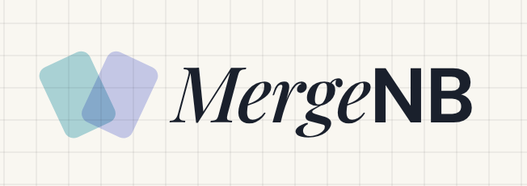
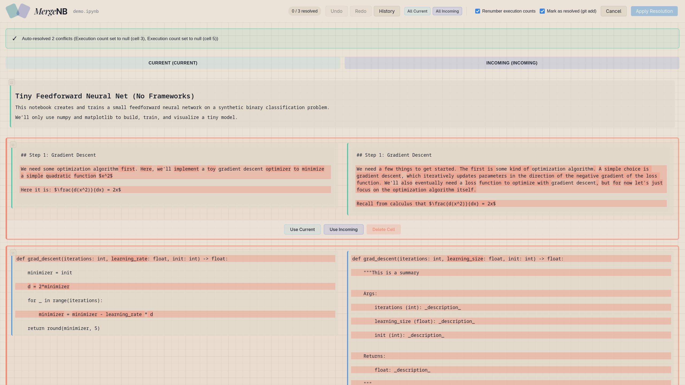
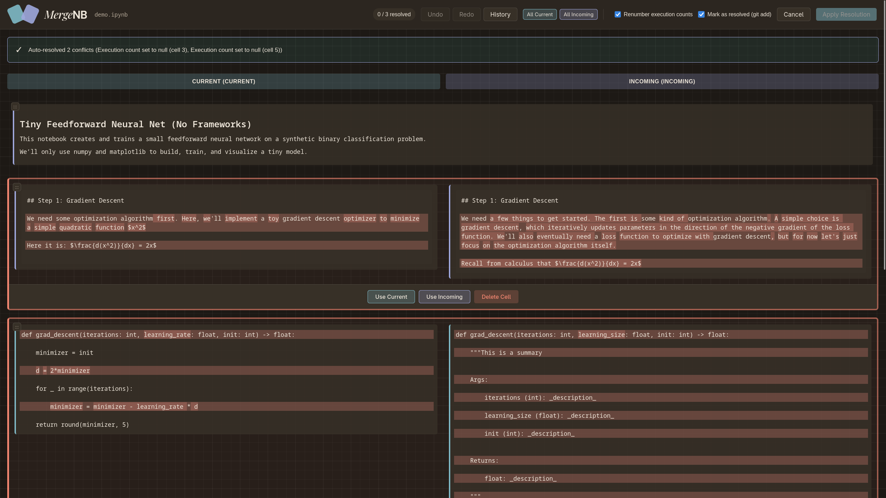

**An intuitive merge conflict resolver built for Jupyter notebooks in VS Code.**

## Background

Merge conflicts are hard, and Jupyter Notebooks' JSON backend makes them inordinately worse. Alternatives like [Marimo](https://github.com/marimo-team/marimo) and converting back and forth through [Jupytext](https://jupytext.org/) have emerged over the years to sidestep the problem by moving away from `.ipynb` entirely.

MergeNB takes a different approach, much like [nbdime](https://github.com/jupyter/nbdime). That is, instead of changing your notebook format, it gives you a web-based GUI purpose-built for resolving Jupyter Notebook merge conflicts cell-by-cell.

## Features

* Side-by-side 2-way and 3-way diff view, with intra-cell conflict highlighting
* A powerful, well-researched cell matching algorithm
* Full JupyterLab rendering engine which fully supports HTML, LaTeX, images, SVG plots, and other MIME types
* Auto-resolution for common conflict types like execution counts, kernel versions, whitespace
* Configurable resolution rules, UI themes, and hotkeys (see [settings](https://avni2000.github.io/MergeNB/docs/settings))
* Full undo/redo history with a panel to jump to any prior resolver state
* [CodeMirror](https://codemirror.net/) syntax highlighting for Python, Scala, R, Julia, and other Jupyter kernels
* Support for MacOS, Windows, and Linux

## Documentation

**Browse the [MergeNB documentation site](https://avni2000.github.io/MergeNB/docs).**

Developers may find the testing and architecture portions particularly useful.

## Installation

See complete [installation instructions on the docs site](https://avni2000.github.io/MergeNB/docs/installation) 

**TL;DR:**

1. Check out the Release page for the last stable version - [MergeNB Releases](https://github.com/Avni2000/MergeNB/releases) - and install the `.vsix` file from there.

2. Then, go to VSCode, look up "Extensions: Install from VSIX..." in the Command Palette, and select the downloaded file.

## Quick start

### 1) Open conflicted notebooks

- Command: `MergeNB: Find Notebooks with Merge Conflicts`
- ID: `merge-nb.findConflicts`
- Also available from notebook context actions and status bar when applicable.

### 2) Resolve in MergeNB UI

Typical flow:

1. See git merge conflicts within a notebook
2. Launch MergeNB command
3. Review each conflict row
4. Choose `base`, `current`, `incoming`, or `delete` per conflict
5. Optionally edit or delete the resolved source text
6. Apply resolution and return to VS Code

### Screenshots:

    

        
    

    

        
    

## Configuration

The [settings page within the docs site](https://avni2000.github.io/MergeNB/docs/settings) is a great resource for this.

## Development

See [Installation](https://avni2000.github.io/MergeNB/docs/installation) for building MergeNB locally.

See [Testing](https://avni2000.github.io/MergeNB/docs/testing) to ensure your changes are properly covered.

## Contributing

Issues and PRs are absolutely welcome.

## License

GPLv3.0 - See [LICENSE](https://github.com/Avni2000/MergeNB/blob/main/LICENSE).
