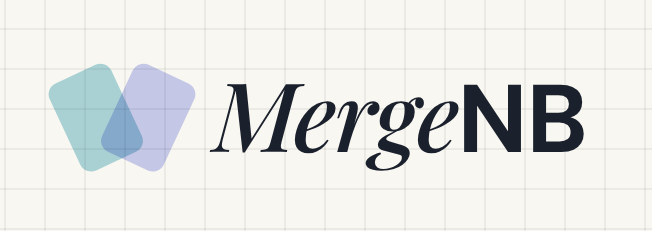
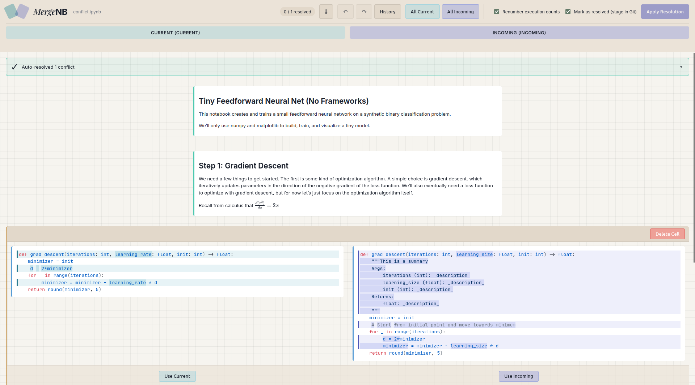
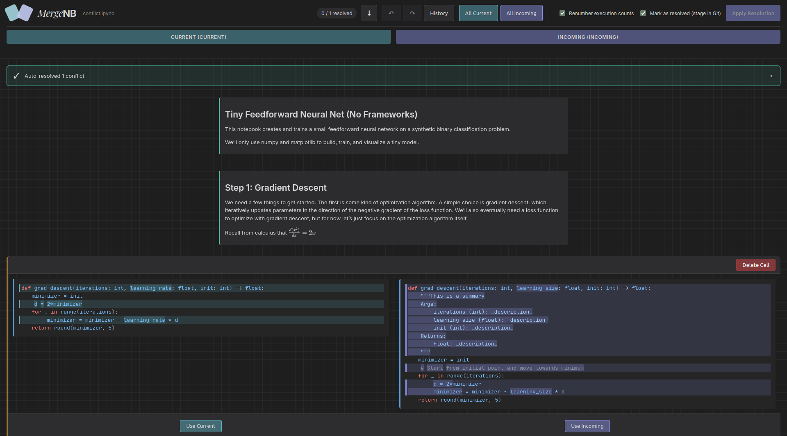

**An intuitive merge conflict resolver built for Jupyter notebooks in VS Code.**

## Background

Merge conflicts are hard, and Jupyter Notebooks' JSON backend makes them inordinately worse. Alternatives like [Marimo](https://github.com/marimo-team/marimo) and converting back and forth through [Jupytext](https://jupytext.org/) have emerged over the years to sidestep the problem by moving away from `.ipynb` entirely.

MergeNB takes a different approach, much like [nbdime](https://github.com/jupyter/nbdime). That is, instead of changing your notebook format, it gives you a web-based GUI purpose-built for resolving Jupyter Notebook merge conflicts cell-by-cell. I have plans to make MergeNB available across a variety of platforms, including as a plain git mergetool (like nbdime), hence the web is the easiest, most universal way to accomplish this.

    
    

*Fig. MergeNB resolver across light and dark themes*

## Features

* Side-by-side 2-way and 3-way diff view, with intra-cell conflict highlighting.
* A powerful, well-researched [cell matching algorithm](https://en.wikipedia.org/wiki/Hungarian_algorithm).
* [JupyterLab's](https://www.npmjs.com/package/@jupyterlab/rendermime) rendering engine which fully supports HTML, LaTeX, images, SVG plots, and other MIME types.
* Auto-resolution for common conflict types like execution counts, kernel versions, whitespace.
* Configurable resolution rules and UI preferences.
* Full undo/redo history with a panel to jump to any prior resolver state.
* [CodeMirror](https://codemirror.net/) syntax highlighting for Python, Scala, R, Julia, and other [supported Jupyter kernels](https://github.com/jupyter/jupyter/wiki/Jupyter-kernels).
* Support for MacOS, Windows, and Linux!

## Installation

1. Check out the Release page for the last stable version - [MergeNB Releases](https://github.com/Avni2000/MergeNB/releases) - and install the `.vsix` file from there.

2. Then, go to VSCode, look up "Extensions: Install from VSIX..." in the Command Palette, and select the downloaded file.

## Quick start

### 1. Open conflicted notebooks

- Command: `MergeNB: Resolve Merge Conflicts`
- ID: `merge-nb.findConflicts`
- Also available from right clicking conflicted file and status bar if applicable.

### 2. Resolve in MergeNB UI

Typical flow:

1. Review each conflict row
2. Choose `base`, `current`, `incoming`, or `delete` per conflict
3. Optionally edit or delete the resolved source text
4. Apply resolution and return to VS Code

## Configuration

MergeNB settings are split up into 3 main types

### Auto-resolution

We optionally auto-resolve a few conflicts:

| Setting                              | Default | Effect                                                         |
| ------------------------------------ | ------- | -------------------------------------------------------------- |
| `mergeNB.autoResolve.executionCount` | `true`  | Sets conflicting `execution_count` to `null` instead of asking |
| `mergeNB.autoResolve.kernelVersion`  | `true`  | Uses current branch's kernel and `language_info.version`       |
| `mergeNB.autoResolve.stripOutputs`   | `true`  | Clears cell outputs during merge                               |
| `mergeNB.autoResolve.whitespace`     | `true`  | Drops trailing-whitespace and CRLF-only diffs silently         |

## UI

UI preferences:

| Setting                             | Default  | Effect                                                                      |
| ----------------------------------- | -------- | --------------------------------------------------------------------------- |
| `mergeNB.ui.theme`                  | `"dark"` | Resolver theme. `"light"` uses a beige palette sourced from the logo.       |
| `mergeNB.ui.hideNonConflictOutputs` | `false`  | Hides outputs for rows without conflicts                                    |
| `mergeNB.ui.showCellHeaders`        | `false`  | Shows cell type, execution count, and cell index in row headers             |
| `mergeNB.ui.showBaseColumn`         | `false`  | Shows the base column in the 3-way view (defaults on in headless/test mode) |
| `mergeNB.ui.enableUndoRedoHotkeys`  | `true`   | Enables `Ctrl/Cmd+Z` and `Ctrl/Cmd+Shift+Z` inside the resolver             |

## Security

| Setting                         | Default                                                                                                      | Effect                                                                                                                                         |
| ------------------------------- | ------------------------------------------------------------------------------------------------------------ | ---------------------------------------------------------------------------------------------------------------------------------------------- |
| `mergeNB.security.trustContent` | `true` in [trusted workspaces](https://code.visualstudio.com/docs/editor/workspace-trust), `false` otherwise | Trusts notebook-authored HTML, Markdown, and rich outputs only when Workspace Trust is enabled. Set to `false` to always use strict rendering. |